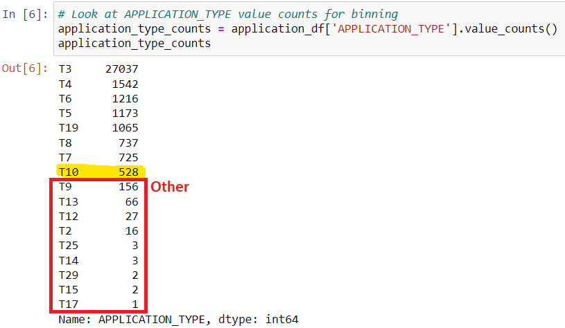
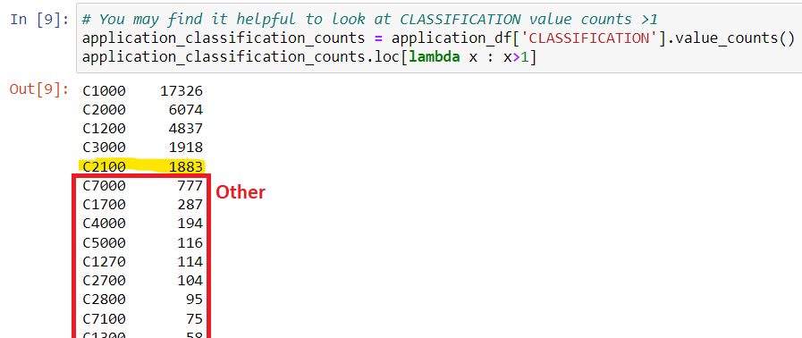
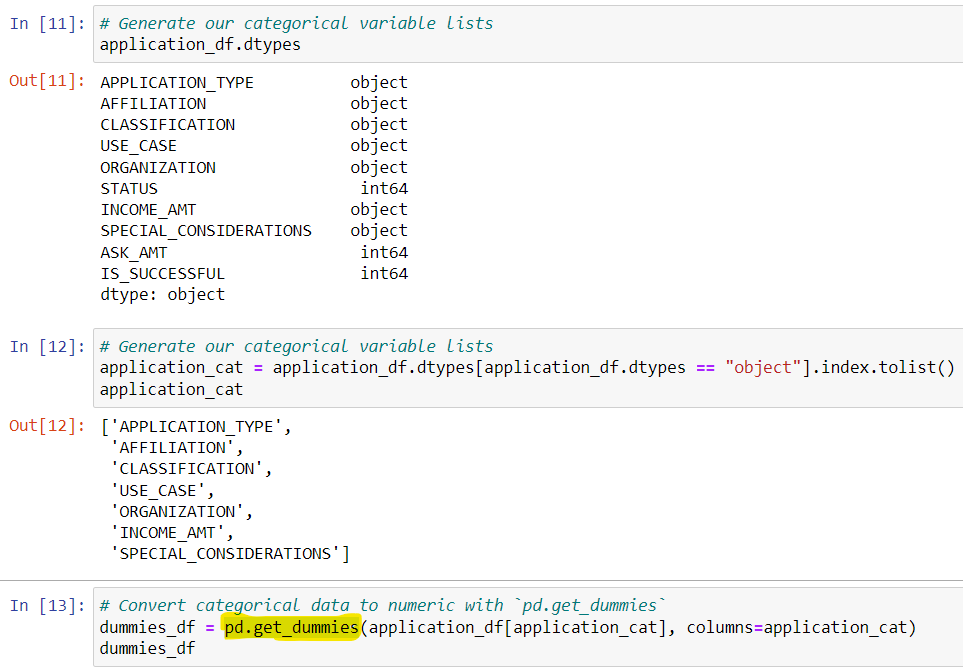
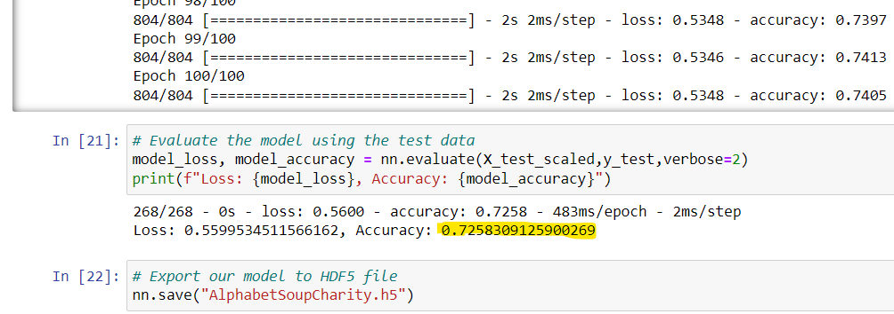
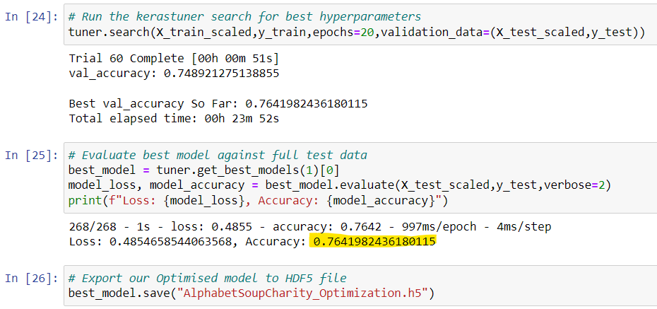

# Alphabet Soup :: Deep Learning Challenge

### Background

The nonprofit foundation **Alphabet Soup** wants a tool that can help it select the applicants for funding with the best chance of success in their ventures.

Alphabet Soup’s business team provided a CSV file containing more than **34,000** organizations that have received funding from Alphabet Soup over the years. Within this dataset are a number of columns that capture metadata about each organization, such as:

-   **EIN**  and  **NAME** — Identification columns
-   **APPLICATION_TYPE** — Alphabet Soup application type
-   **AFFILIATION** — Affiliated sector of industry
-   **CLASSIFICATION** —G overnment organization classification
-   **USE_CASE** — Use case for funding
-   **ORGANIZATION** — Organization type
-   **STATUS** — Active status
-   **INCOME_AMT** — Income classification
-   **SPECIAL_CONSIDERATIONS** — Special considerations for application
-   **ASK_AMT** — Funding amount requested
-   **IS_SUCCESSFUL** — Was the money used effectively

### Technical Requirements

The implementation of this project requires the use of [TensorFlow](https://www.tensorflow.org/install/pip).

## Alphabet Soup

The main objective of this project is to develop a solution using the knowledge on machine learning and neural networks, analysing the features in the provided dataset to create a binary classifier that can predict whether applicants will be successful if funded by Alphabet Soup.

### Overview

This projects aims to analyse different models to implement a solution for the Alphabet Soup database.

The first model consists in a multi-layer Neural Network, that can be setup to be trained using a reduced database, and finally the evaluation of its performance.

Last but not least, an optimisation of the first model is considered in this project, where there are further analysis on the features that have been used, as well as combination of different setup to find an optimisation of this model.

This report is organised in 3 main sections
 * Preprocess the Data
 * Compile, Train, and Evaluate the Model
 * Optimise the Model

### Preprocess the Data

The initial steps required for this project is to preprocess the data, removing the unwanted columns, if any, as well as converting the data type when it is appropriate.

The column `IS_SUCCESSFUL` is assigned as the target variable for the proposed model.

The columns `EIN`  and  `NAME` have been removed from the input data, considering those variables are identifiers for each entry in the database.

The remaining columns (`APPLICATION_TYPE`, `AFFILIATION`, `CLASSIFICATION`, `USE_CASE`, `ORGANIZATION`, `STATUS`, `INCOME_AMT`, `SPECIAL_CONSIDERATIONS` and `ASK_AMT`) are assigned to be the features analysed by the proposed model.

After the definition of the target variable and the set of features, it was applied a binning technique to reduce the number of different groups within a feature. The following features (columns) were  revised:
* `APPLICATION_TYPE`: as presented in the figure below, a cutoff value of **528** was applied to identify the list of application types to be replaced by "Other".

* `CLASSIFICATION`: as presented in the figure below, a cutoff value of **1883** was applied to identify the list of classifications to be replaced by "Other".

Finally, the categorical features that are not numeric to be converted accordintly using the function `pd.get_dummies`, which is presented in the figure below:

After all these previous steps, data can be now processed and scaled accordingly to prepare the training and test data, which will be used for the further phases of this project.

### Compile, Train, and Evaluate the Model

The model consists in a Neural Network, using `TensorFlow` and `Keras`, setting up its `Sequential` model. The following details are used for the proposed model:
* Input layer of this Sequential model to process the different **43 features**.
* Two hidden layers (**80 units** and **30 units**, respectively), both using `relu` as activation function.
* Output layer using `sigmoid` as activation function.

After the model is created and setup complete, we proceed to compile the model using `binary_crossentropy`, optimizer set to `adam`, and metrics for `accuracy`.

The model is finally trained in **100 epochs**, achieving a significant accuracy of **72.58%**.

### Optimize the Model

Despite this proposed model presented a significant accuracy (**72.58%**), some further analysis could be considered in order to optimise the results, increasing the performance of the model.

After a few attempts with no much improvement, some changes were considered in this model to improve its performance, as detailed below:

1. In the Preprocessing of the Data, some steps were implemented
	* The column `NAME` was not removed as initially, and the binning technique to group names with less than **50** entries to be assigned as "Other".
	* The columns (features) `STATUS` and `SPECIAL_CONSIDERATIONS` were removed, since they split the information in 2 groups only, and not clear relationship with the target.
	* The cutoff for the `CLASSIFICATION` column was changed from **1883** to **20**.
	* After categorical features converted to numeric fields, the database is now listing 34299 rows accross 109 columns (**1 target** and **108 features**).
2. In the Compiling and Training, it was used `hyperparameter` and `keras_tuner` to run all possible combinations of the proposed model, aiming to find the configuration with the best results and accuracy. The training also considering 20 epochs.
3. Accuracy: **76.42%**

## References

IRS. Tax Exempt Organization Search Bulk Data Downloads.  [https://www.irs.gov/](https://www.irs.gov/charities-non-profits/tax-exempt-organization-search-bulk-data-downloads)